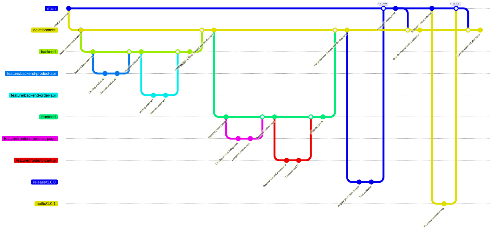

# Kulhad Shop Platform
Repository for the Kulhad Shop platform, including backend services, frontend application, database pipelines, and utilities used to manage orders, products, and customer interactions.

## Git Branching Strategy



## Quick Start

### 1. Start the backend

```bash
cd backend
python -m venv .venv
.venv\Scripts\activate
pip install -r requirements.txt
python app.py
```

Create the backend virtual environment inside the `backend/` folder, not at the repository root. This keeps Python dependencies isolated from the frontend and matches the backend documentation.

If you need the kulhad image-detection endpoints, use Python 3.10 to 3.12 for the backend virtual environment because Roboflow `inference-sdk` is not currently available on Python 3.13.

The backend runs on:

```text
http://127.0.0.1:5000
```

### 2. Start the frontend

```bash
cd frontend
npm install
npm run dev
```

The frontend runs on:

```text
http://localhost:5173
```

## Main Modules

- Customer: store, cart, checkout, account profile, order history, reorder
- Admin: dashboard, analytics, inventory, raw inventory, products, product history, orders, customers, employees, payroll
- Employee: production dashboard, production entries, self profile

## Platform Capabilities

### Customer Experience

- Dedicated checkout flow linked from cart
- Customer address save flow through backend profile and order APIs
- Previous-address suggestion in checkout
- Backend-backed My Account profile data
- Order history in My Account
- Reorder support for previously placed orders

### Admin Experience

- Analytics dashboard
- Product Management with categories
- Inventory that uses stored product categories
- Order management with payment-status updates
- Bulk payment confirmation in the orders dashboard
- Order filtering by payment method and other status fields
- Payroll Management
- Raw Inventory Management

### Employee Experience

- Employee self-profile page
- Email editing blocked on self-profile pages
- Password reset for customer and employee profiles
- Backend-driven employee entries page
- Attendance derived from actual production entries
- Future-date production entries blocked
- Employee dashboard charts and totals powered by live backend data
- Employee production entry selection based on Product Management product names

### Backend Improvements

- Route groups for payroll, profile, production, and extended order flows
- SQLite schema upgrade handling for evolving fields
- Product category support at the data model layer
- Raw inventory fields on inventory records
- Payment-status persistence
- Customer address details including city, state, and postal code

## Suggested Read Order

If you are new to the repository, this sequence is the easiest:

1. Read this file for project overview and startup.
2. Read [INTEGRATION_README.md](./INTEGRATION_README.md) for frontend-backend interaction.
3. Read [frontend/README.md](./frontend/README.md) for routes and UI modules.
4. Read [backend/README.md](./backend/README.md) for route groups, schema behavior, and backend responsibilities.

## Documentation

- Integration guide: [INTEGRATION_README.md](./INTEGRATION_README.md)
- Frontend guide: [frontend/README.md](./frontend/README.md)
- Backend guide: [backend/README.md](./backend/README.md)
- Testplan guide: [backend/TEST_PLAN_PYTEST.md](./backend/TEST_PLAN_PYTEST.md)
- API documentation: [backend/API_DOCUMENTATION.md](./backend/API_DOCUMENTATION.md)